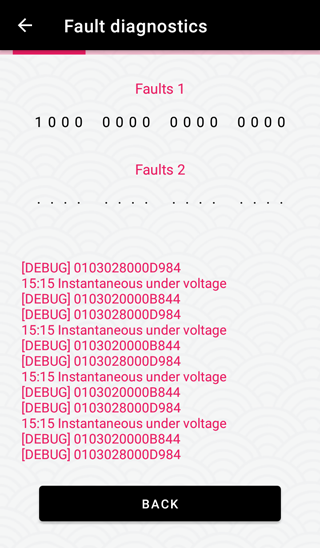

## I've got a Cowboy and what is this?

This Android app lets you **set custom max speed** on a **Cowboy bike** (all models) or **remove speed limit** completely. Working with **firmware 4.11.3** and lower.

⠀

## Remove speed limit? Sign me up!

[Download Bronco Unleashed](https://github.com/hackboyMcHack/bronco/releases/download/5.0/BroncoUnleashed50.apk)

⠀

---
⠀

     

⠀

---

⠀

## What's new in version 5

- **Dashboard fix for firmware 4.11 (app version 3.0)**

Upcoming:

- Trip summary screen
- Active tracking to .gpx

⠀

---

⠀

## How do I install it?

You probably know that but just in case:

1. Open Settings in your Android phone
2. Tap `Security`
3. Check the `Unknown Sources` option
4. You can now open the `.apk` and install it

⠀

---

⠀

## Any other things I need to know?

#### Are the changes I make permanent?

If you only choose to change the speed limit, the official app *will* overwrite it to 32 (V1, V2) or 28 (V3). You can also remove the limit completely which can only be reverted with Bronco Unleashed. Or you can just ditch the official app completely.

#### How do I revert this?

Default values are: speed limit enabled, 25km/h, field weakening 0%. You can set all these values back to default using this app.

#### Can I use this instead of the official app?

Bronco Unleashed features a rudimentary dashboard which provides all the information the official app does, except the map. You will probably want to use a standalone navigation app anyway, because the official one sucks. Right? 

#### Who is responsible if this f\*cks my bike up?

You. I don't give you any guarantee that this app will even work so use it at your own risk.

#### I liked the previous version more.

[You can still get them](https://github.com/hackboyMcHack/bronco/releases).

⠀

---

⠀

# DISCLAIMER

**YOU ARE USING THIS APP AT YOUR OWN RISK.** I'm not repsonsible for any damage that may result from you interacting with this software in any way.

⠀

⠀

⠀

