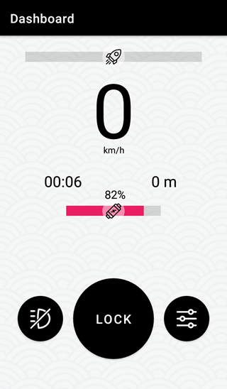
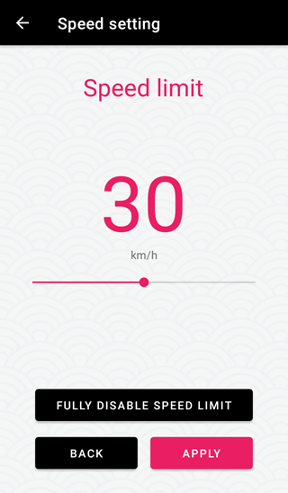
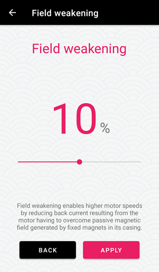
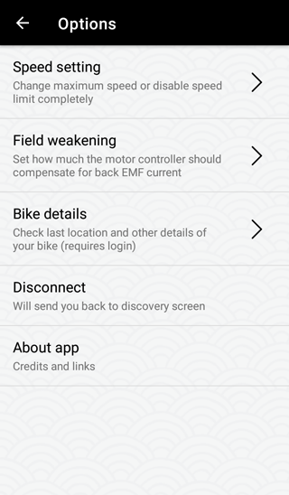
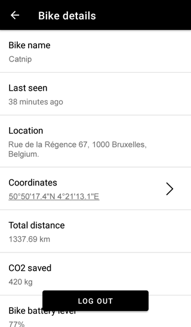

⠀

# DISCLAIMER

**YOU ARE USING THIS APP AT YOUR OWN RISK.** I'm not repsonsible for any damage that may result from you interacting with this software in any way.

⠀

---

⠀

## What?

This Android app lets you set custom max speed on a CBY 3 bike or remove the speed restriction completely. Tested on firmware `4.10.0`.

## Where?

[Download Bronco Unleashed](https://github.com/hackboyMcHack/bronco/releases/download/3.5/BroncoUnleashed35.apk)

⠀

---
⠀

    

⠀

---

⠀

## How?

### App installation

You probably know that but just in case:

1. Open Settings in your Android phone
2. Tap `Security`
3. Check the `Unknown Sources` option
4. You can now open the `.apk` and install it

⠀

### Usage

1. Make sure your bike is paired with the CBY app and Bluetooth is on. 
2. Open ***Bronco Unleashed*** app.
3. Choose the bike you want to connect to.
4. You can now control the bike, change its options etc.

⠀

---

⠀

## Why?

I was bored and I like poking around.

⠀

---

⠀

## FAQ

#### Is this change permanent?

If you only choose to change the speed limit, the official app may overwrite it depending on the platform and your bike version. You can also remove the limit completely which can only be reverted with Bronco _version Unleashed_.

#### How do I revert this?

Default values are: speed limit enabled, 25km/h, field weakening 0%. You can set all these values back to default using this app.

#### Can I use this instead of the official app?

Bronco Unleashed features a rudimentary dashboard which provides all the information that the official app does, except the map. You will probably want to use a standalone navigation app anyway, because the official one sucks. Right? 

#### Notification? why?

Due to how the dashboard works, the app requires a background service. At this point I may as well show the info as a notification. If you don't like it, you can deny the app from pushing notifications in Android settings.

#### Who is responsible if this f\*cks my bike up?

You. I don't give you any guarantee that this app will even work so use it at your own risk.

#### I liked the previous version more.

[You can still get them](https://github.com/hackboyMcHack/bronco/releases).

⠀

⠀

