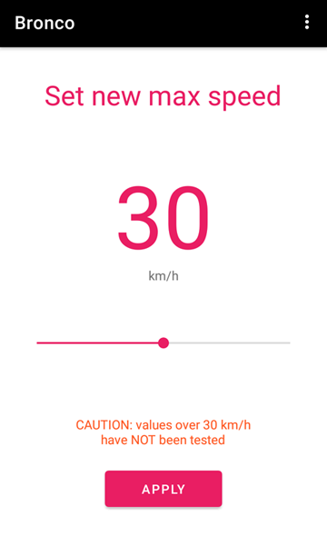

⠀

# DISCLAIMER

**YOU ARE USING THIS APP AT YOUR OWN RISK.** I'm not repsonsible for any damage that may result from you interacting with this software in any way.

⠀

---

⠀

## What?

This Android app lets you set custom max speed on a CBY 3 bike. Tested on firmware `4.10.0`.

## Where?

[Download app](https://github.com/hackboyMcHack/bronco/releases/download/2.0.0/BroncoUnleashed.apk)

⠀

---
⠀

⠀

---

⠀

## How?

### App installation

You probably know that but just in case:

1. Open Settings in your Android phone
2. Tap `Security`
3. Check the `Unknown Sources` option
4. You can now open the `.apk` and install it

### Usage

1. Make sure your bike is paired with the CBY app. 
2. Open the ***Bronco Unleashed*** app, tap "Connect to bike"
3. Unlock the bike by tapping "Unlock".
4. Tap "Gear".
5. Choose your new speed and tap "Apply".
6. Done, you can close the app, or continue to use it if you like it more than the official one.

⠀

---

⠀

## Why?

For the lulz. It was a fun challenge.

⠀

---

⠀

## FAQ

#### Is this change permanent?

You have the choice of changing the speed limit, which would work until you connect the official app again, or disabling it completely, which can only be reverted using Bronco Unleashed.

#### How do I revert this?

Go to speed setting, tap "Enable speed setting", set speed to 25, tap "Apply".

#### Can I use this instead of the official app?

Bronco Unleashed features a rudimentary dashboard which provides all the information that the official app does, except the map. You will probably want to use a standalone navigation app anyway, because the official navigation sucks. Right? 

#### Notification? why?

Due to how the dashboard works, the app requires a background service. At this point I may as well show the info as a notification. If you don't like it, you can deny the app from pushing notifications in Android settings.

#### Who is responsible if it f**ks my bike up?

You. I don't give you any guarantee that this app will even work so use it at your own risk.

⠀

⠀

